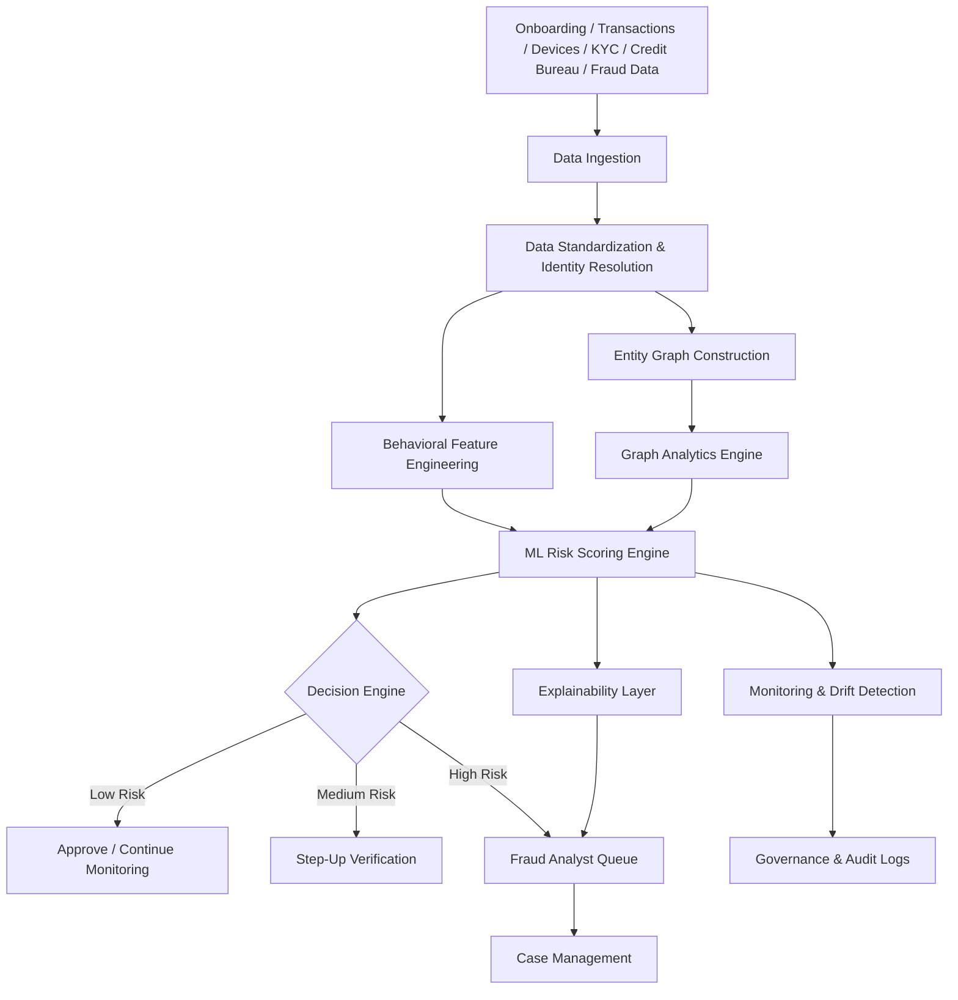

# Synthetic Identity Fraud Detection Architecture

## Architecture Description
The platform collects identity, device, account, transaction, login, KYC, and external fraud intelligence data. Identity resolution standardizes names, addresses, phones, emails, SSNs, devices, and account identifiers.

The graph layer models relationships among customers, accounts, devices, addresses, phones, IP addresses, transactions, and counterparties. Graph analytics identifies suspicious clusters, shared attributes, community patterns, central nodes, and synthetic identity rings.

The behavioral scoring layer evaluates login behavior, transaction activity, geolocation patterns, device usage, account age, and credit-building behavior. The final risk score combines graph features, behavioral indicators, and machine learning outputs.
